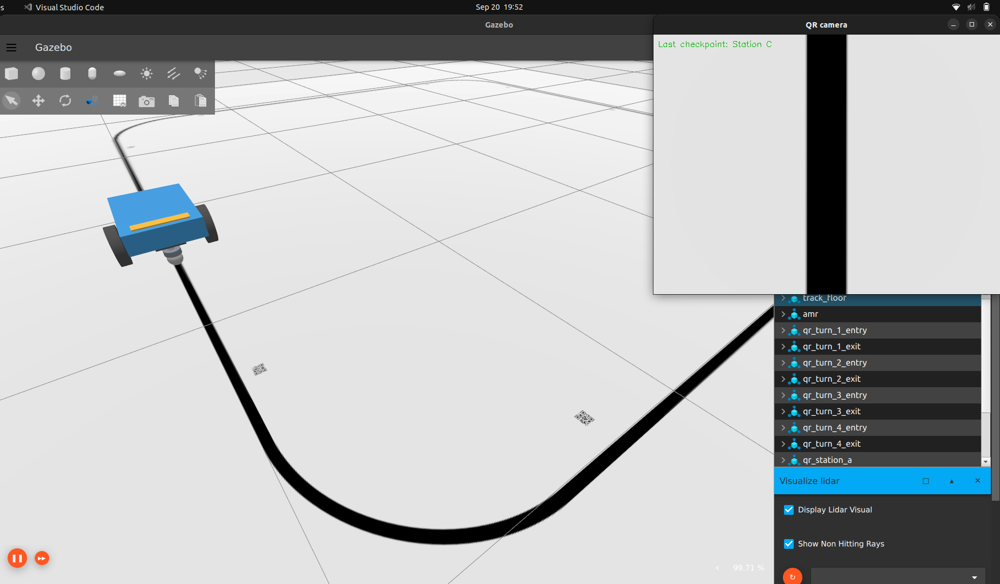
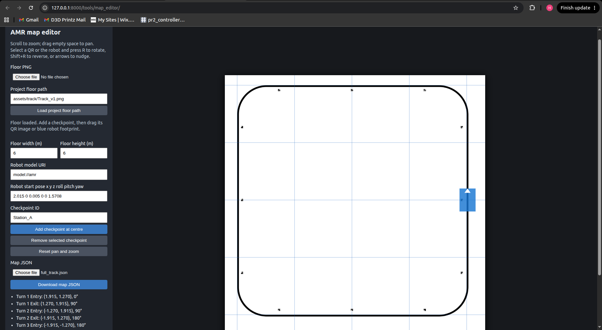

# TrackTag Navigation — Ignition Fortress AMR line following and QR checkpoints

A lightweight AMR simulation for **Ignition Gazebo Fortress**. The robot follows a black floor line using five downward-facing RGB cameras and reads checkpoint IDs through a separate QR camera.

No ROS, SLAM, EKF, sensor fusion, or QR-based localization is used. QR codes are visual-only checkpoint identifiers.



▶ [Watch the TrackTag Navigation demo](assets/media/TrackTagDemo.mp4)

## Features

- Native Ignition Transport velocity control on `/amr/cmd_vel`
- Five 16×16 line cameras at 15 FPS; one 640×480 QR camera at 5 FPS
- One C++17 controller process: line following and QR reading run concurrently
- 50 Hz physics, Ogre2, and disabled shadows for performance
- Browser map editor with QR placement, robot start pose, pan/zoom, rotate, and QR copy/paste
- JSON-to-SDF generation for new worlds without changing the baseline world

## Requirements

Install Ignition Gazebo Fortress with Ogre2 support, then install dependencies:

```bash
sudo apt update
sudo apt install build-essential cmake pkg-config \
  libignition-transport11-dev libignition-msgs8-dev \
  libopencv-dev libzbar-dev python3-qrcode python3-pil
```

For NVIDIA GPU rendering, confirm the driver is active:

```bash
nvidia-smi
```

## Build

```bash
git clone <your-repository-url> track-tag-navigation
cd track-tag-navigation
cmake -S . -B build -DCMAKE_BUILD_TYPE=Release
cmake --build build -j2
```

`build/track_tag_navigation_controller` is the single C++ executable. `build/track-tag-navigation` launches it together with Fortress.

## Run the included world

```bash
./build/track-tag-navigation
```

Press **Play** in Fortress, or start immediately:

```bash
./build/track-tag-navigation --run
```

For an initial QR visibility check:

```bash
./build/track-tag-navigation --run --view
```

Use `Ctrl+C` in the launcher terminal to stop; it sends a zero velocity command. Omit `--view` for normal operation because the QR display window adds overhead.

### Launcher options

```text
./build/track-tag-navigation --run
./build/track-tag-navigation --view
./build/track-tag-navigation --headless
./build/track-tag-navigation --run --world sdf/my_map.sdf
```

`--headless` retains off-screen camera sensors but removes the Fortress GUI, making it useful for real-time-factor tests.

On hybrid NVIDIA systems, force the discrete GPU if needed:

```bash
__NV_PRIME_RENDER_OFFLOAD=1 \
__GLX_VENDOR_LIBRARY_NAME=nvidia \
./build/track-tag-navigation --run
```

## Baseline behavior

The default world is `sdf/track_with_qr.sdf`.

- Physics: 50 Hz (`max_step_size = 0.02`)
- Five line cameras: 15 FPS, 16×16 RGB
- QR camera: 5 FPS, 640×480 RGB
- Line-controller loop: approximately 30 Hz; terminal logging: 2 Hz

The controller stops when the line is lost or camera data is stale. It does not search for a line, stop at stations, route junctions, or estimate pose.

## Create a custom map

Keep QR codes separate from the floor PNG. A 50 mm QR baked into a 3000×3000, 6×6 m floor texture is too low-resolution for reliable decoding. This project generates a high-resolution QR texture for each visual-only SDF marker.

### 1. Add a floor PNG

Create or export a floor texture from Inkscape, then add it to the project:

```bash
cp /path/to/my_track.png assets/track/my_track.png
```

### 2. Open the map editor

```bash
python3 scripts/map_editor_server.py
```

Open `http://127.0.0.1:8000/tools/map_editor/`.



1. Select the floor PNG for preview.
2. Set **Project floor path** to `assets/track/my_track.png`.
3. Add checkpoint IDs and place their QR images beside the line.
4. Drag the blue robot footprint to set its starting position.
5. Set robot yaw in the six-value start-pose field.
6. Download the JSON and save it under `maps/`.

Editor controls:

| Action | Control |
|---|---|
| Zoom / pan | Mouse wheel / drag empty map |
| Multi-select QRs | Ctrl/Cmd + click |
| Rotate selected QR(s) or robot | `R`; `Shift+R` reverses |
| Nudge selected object(s) | Arrow keys; Shift = 5 cm |
| Copy / paste QRs | Ctrl/Cmd + `C`, Ctrl/Cmd + `V` |
| Rename a selected QR | Edit **Checkpoint ID**, press Enter |
| Delete selected QR(s) | Delete |

Keep QR markers beside—not across—the line or beneath the line-sensor strip. Use `--view` for the first run of every new map.

### 3. Generate and run the world

```bash
python3 scripts/generate_map.py maps/my_map.json --output sdf/my_map.sdf
./build/track-tag-navigation --run --view --world sdf/my_map.sdf
```

After validation:

```bash
./build/track-tag-navigation --run --world sdf/my_map.sdf
```

To regenerate the same output after editing JSON:

```bash
python3 scripts/generate_map.py maps/my_map.json --output sdf/my_map.sdf --force
```

`--force` replaces only that generated world and its QR textures. The baseline `sdf/track_with_qr.sdf` remains unchanged.

## Modular robot models

Generated worlds refer to a reusable SDF model rather than inlining all robot links, joints, cameras, and plugins:

```xml
<include>
  <uri>model://amr</uri>
  <pose>0 -2 0.005 0 0 0</pose>
</include>
```

The supplied model package is `models/amr/`. To export an `amr` model from another tuned world:

```bash
python3 scripts/export_robot_model.py path/to/robot_world.sdf --output models/my_robot
```

Then set the map JSON or editor robot URI to `model://my_robot`.

## Topics

| Topic | Message type | Purpose |
|---|---|---|
| `/amr/cmd_vel` | `ignition.msgs.Twist` | Velocity command |
| `/amr/line_0/image` … `/amr/line_4/image` | `ignition.msgs.Image` | Line cameras |
| `/amr/qr/image` | `ignition.msgs.Image` | QR camera |
| `/amr/odometry` | Ignition odometry | Diff-drive odometry |
| `/model/amr/tf` | Ignition transform | Model transform |

## Layout

```text
assets/    Floor textures and generated QR textures
docs/      Component notes
include/   C++ headers
maps/      Editable map JSON files
models/    Reusable SDF model packages
sdf/       Baseline and generated worlds
scripts/   Launch, map, and model utilities
src/       C++ controller modules
tools/     Browser map editor
```

## Troubleshooting

- `WAITING`: press Play and ensure simulator and controller share `IGN_PARTITION` if you set one.
- QR not decoding: use `--view`; confirm the whole QR plus white border is visible.
- Manual stop command:

  ```bash
  ign topic -t /amr/cmd_vel -m ignition.msgs.Twist \
    -p 'linear: {x: 0.0}, angular: {z: 0.0}'
  ```
